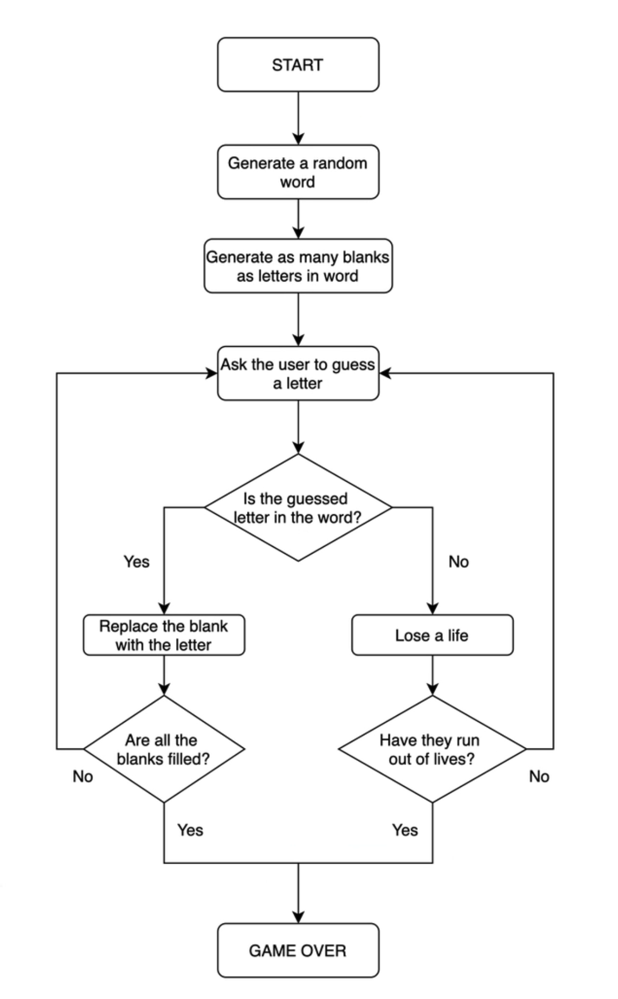
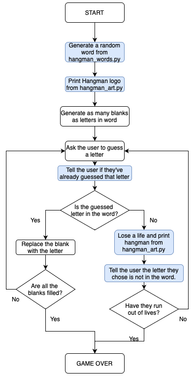

# Day 7 - Hangman Game

Today we will be using all of the previous days' lessons
('for'/'while' loops, 'if/elif'/else' statements, lists,
strings, ranges and modules) to build a complete game of
Hangman within our console.

We will employ the following parts of Python that we have
learned about:
```python
for # loops
while # loops
if # statements
elif # statements
else # statements
lists = ["item1", "item2", "item3"]
variables_and_strings = ("Variables and Strings")
ranges = (1, 101, 2)
import modules
```

One of the ways that we can help ourselves with the
problem-solving aspect of Python is to create a visual
flowchart that gives us a sense of where to begin and
the steps in between the problem that we want to solve
and the logic needed to solve the problem.

For an example of a flowchart that will help us with our
Hangman game, see the flowchart image included in this
day's Notes Folder: 



Later on in today's challenge, we will need to reference
a slightly different flowchart image based on the previous
challenges used to build the game:


Once the project is finished, our final flowchart should
resemble the Final Hangman flowchart shown here:

